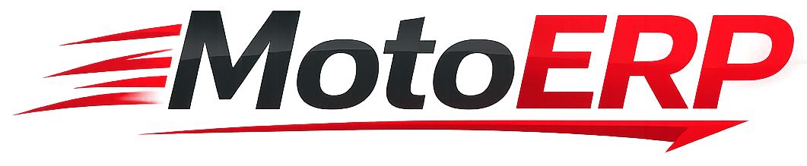

# MotoERP - Landing Page V3



## 🏎️ Sobre o Projeto

O **MotoERP** é uma landing page moderna e de alta performance desenvolvida para apresentar um sistema ERP SaaS especializado no setor automotivo (autopeças, oficinas, moto-peças e distribuidores). 

Esta versão (V3) foca em uma identidade visual forte, utilizando o contraste entre o vermelho (Ember) para ação e o preto (Carbon) para autoridade, transmitindo velocidade operacional e confiabilidade na gestão.

## 🚀 Funcionalidades Apresentadas

O site destaca os principais módulos integrados do sistema:

- **PDV Rápido:** Fluxo otimizado para vendas de balcão e cupons fiscais.
- **Estoque com Rastreabilidade:** Controle total de entradas, saídas, custos e alertas de ruptura.
- **Compras e Fornecedores:** Histórico de preços, prazos e gestão de reposição.
- **Financeiro Estratégico:** Fluxo de caixa, contas a pagar/receber e visão de lucro.
- **CRM Básico:** Histórico de compras por cliente e métricas de relacionamento.
- **Relatórios Práticos:** Dashboards executivos com métricas em tempo real.

## 🛠️ Tecnologias Utilizadas

Este projeto foi construído focando em simplicidade de manutenção e velocidade de carregamento:

- **HTML5:** Estrutura semântica e SEO-friendly.
- **Tailwind CSS:** Estilização via CDN com configurações personalizadas para a marca.
- **Vanilla JavaScript:** Lógica leve para animações de revelação (Scroll Reveal) e contadores numéricos animados.
- **Intersection Observer API:** Para ativação de animações baseada na visibilidade do usuário.
- **Google Fonts (Manrope):** Tipografia moderna para melhor leitura.

## 📊 Diferenciais Visuais (V3)

- **Alta Energia:** Uso estratégico do vermelho para CTAs e pontos de atenção.
- **Autoridade:** Design "dark-themed" em seções críticas para passar seriedade.
- **Movimento:** Linhas e diagonais que acompanham a identidade visual da logo.
- **Responsividade:** Totalmente adaptado para dispositivos móveis, tablets e desktops.

## 📁 Estrutura do Projeto

```text
motoerp/
├── assets/          # Imagens, logos e ícones
├── index.html       # Arquivo principal da landing page
└── README.md        # Documentação do projeto
```

## 💻 Como Visualizar

1. Clone este repositório ou baixe os arquivos.
2. Certifique-se de que a pasta `assets` está no mesmo diretório que o `index.html`.
3. Abra o arquivo `index.html` em qualquer navegador moderno.

---

Desenvolvido com foco em **velocidade** e **conversão**.
